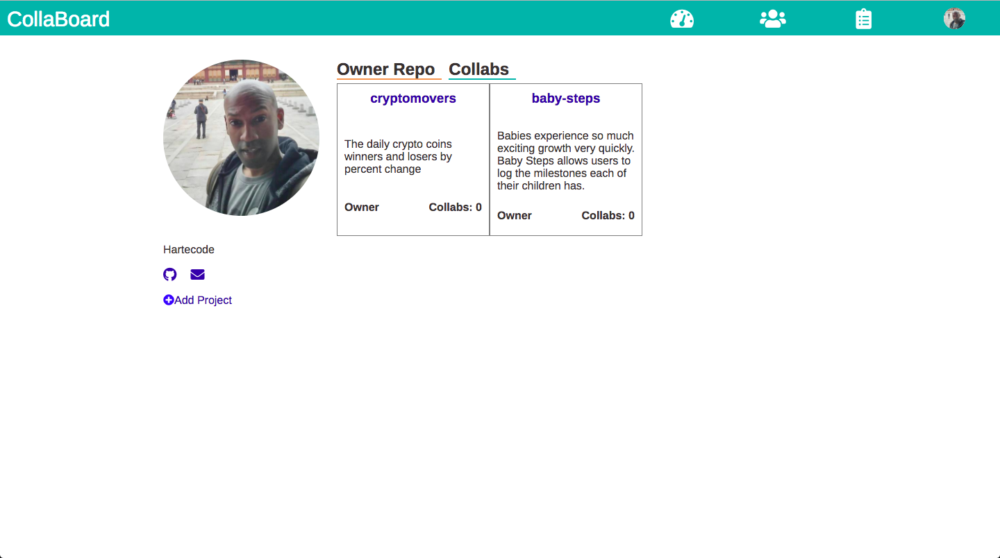

<h1>Collab Board</h1>

Collab Board is where a user can post a project they are seeking collaboration on and also search for a project where they can be a co-collaborator. The user can deny or approve any requests they receive. The user can also view their owned and collab projects.

<h2>Screen Shots</h2>

<h3>Landing Page</h3>

<h3>Sign In/Sign Up</h3>

<h3>Dashboard</h3>

<h3>Board</h3>

<h2>DEMO</h2>

<h3><a href="https://zealous-joliot-ccbd2b.netlify.com" target="_blank">Live Demo</a></h3>

<h2>Technology</h2>

Client Side
<ul>
	<li>React.js</li>
	<li>Redux</li>
	<li>ES6</li>
	<li>HTML</li>
	<li>CSS</li>
	<li>Webpack</li>
	<li>Babel</li>
</ul>

Server Side
<a href="https://github.com/Hartecode/collab-board-backend" target="_blank">Back-end repo</a>
<ul>
	<li>Node.js</li>
	<li>express</li>
	<li>mongoDB</li>
	<li>mongoose</li>
	<li>passport</li>
	<li>chai</li>
	<li>github oauth2</li>
</ul>
 
Third Party Resources 

Client Side
<ul>
	<li><a href="https://travis-ci.org/" target="_blank">Travis CI</a></li>
	<li><a href="https://www.netlify.com/" target="_blank">netlify</a></li>
</ul>
Server Side
<ul>
	<li><a href="https://mlab.com/welcome/" target="_blank">mlab</a></li>
	<li><a href="https://travis-ci.org/" target="_blank">Travis CI</a></li>
	<li><a href="https://www.heroku.com/home" target="_blank">heroku</a></li>
</ul>